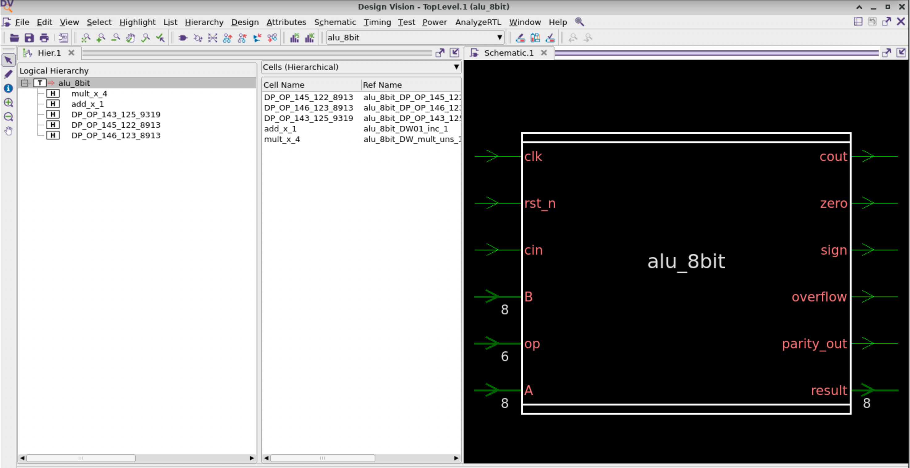
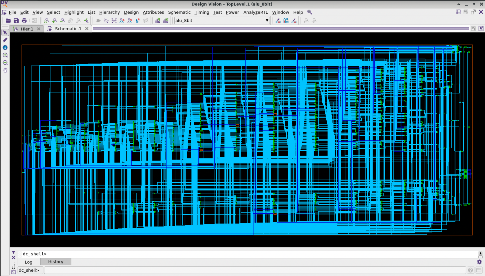

# 8-bit ALU Design Compiler Synthesis Workflow

This document describes the RTL synthesis workflow for the 8-bit ALU using Synopsys Design Compiler. It focuses only on the `DC_8bit` flow and the execution of `run_dc.tcl`.

## Table of Contents

- [Project Overview](#project-overview)
- [Folder Structure](#folder-structure)
- [Pre-Execution Setup](#pre-execution-setup)
- [Running the Script](#running-the-script)
- [Execution Stages](#execution-stages)
  - [Stage 1: Analyze](#stage-1-analyze)
  - [Stage 2: Elaborate](#stage-2-elaborate)
  - [Stage 3: Compile Ultra](#stage-3-compile-ultra)
- [Design Vision Schematics](#design-vision-schematics)
- [Post-Execution Results](#post-execution-results)
- [Results Analysis](#results-analysis)
- [Recommended Completion Checklist](#recommended-completion-checklist)

## Project Overview

The `DC_8bit` project contains the Design Compiler synthesis setup for the `alu_8bit` RTL design. The flow reads the Verilog source, applies Synopsys Design Constraints, performs RTL synthesis with `compile_ultra`, and writes mapped design outputs plus synthesis reports.

The main script is:

```text
./run_dc.tcl
```

The script performs three primary synthesis stages:

1. Analyze the RTL source from `../rtl/alu_8bit.v`.
2. Elaborate the `alu_8bit` design hierarchy.
3. Compile and optimize the design using `compile_ultra`, including a multi-Vt constraint that limits LVT cell usage to 20%.

## Folder Structure

The flow is intended to be executed from the `DC_8bit` directory.

```text
DC_8bit/
├── run_dc.tcl
├── rm_setup/
│   ├── common_setup.tcl
│   ├── dc_setup.tcl
│   └── dc_setup_filenames.tcl
├── WORK/
├── results/
├── reports/
└── Reports/
    ├── images of reports (.png)

../rtl/
└── alu_8bit.v

../CONSTRAINTS/
└── alu_8bit.sdc
```

| Path | Description |
| --- | --- |
| `./run_dc.tcl` | Main Design Compiler TCL script for synthesis execution. |
| `./rm_setup/` | Setup and configuration files sourced by `run_dc.tcl`. |
| `./rm_setup/common_setup.tcl` | Defines the top-level design name, library paths, technology file paths, and PDK-dependent setup variables. |
| `./rm_setup/dc_setup.tcl` | Design Compiler setup script. It sources the common setup and filename setup files, configures libraries, and creates `reports/` and `results/`. |
| `./rm_setup/dc_setup_filenames.tcl` | Defines standard output filenames such as `alu_8bit.mapped.v`, `alu_8bit.mapped.ddc`, `alu_8bit.mapped.sdf`, and `alu_8bit.mapped.sdc`. |
| `./WORK/` | Design Compiler work library used for analyzed intermediate design data. It is defined by `define_design_lib WORK -path ./WORK`. |
| `./results/` | Generated output directory for mapped design files, DDC files, SDF, SDC, and SVF output. Created by `dc_setup.tcl` if it does not already exist. |
| `./reports/` | Generated output directory for synthesis reports. Created by `dc_setup.tcl` if it does not already exist. |
| `./Reports/` | Existing repository directory that may be used for manually collected screenshots or archived documentation. The synthesis script writes to lowercase `reports/`, not `Reports/`. |
| `../rtl/` | RTL source directory containing `alu_8bit.v`. |
| `../CONSTRAINTS/` | Constraint directory containing `alu_8bit.sdc`. |

## Pre-Execution Setup

Before running `run_dc.tcl`, capture the baseline state of the design directory. This gives you a clear record of the design state before synthesis output files are generated.

Start from the `DC_8bit` directory:

```sh
cd "BLock Level Design (8bit ALU)/DC_8bit"
```

Confirm that the expected input files are present:

```text
../rtl/alu_8bit.v
../CONSTRAINTS/alu_8bit.sdc
./run_dc.tcl
./rm_setup/common_setup.tcl
./rm_setup/dc_setup.tcl
./rm_setup/dc_setup_filenames.tcl
```

Recommended baseline documentation:

- Capture the current `DC_8bit` directory listing before execution.
- Capture the contents or file listing of `../rtl/`.
- Capture the contents or file listing of `../CONSTRAINTS/`.
- Note whether `./WORK/`, `./results/`, and `./reports/` already exist before the run.
- Save or screenshot the opening state of `run_dc.tcl`.
- Save or screenshot the key constraint definitions in `../CONSTRAINTS/alu_8bit.sdc`, including the clock, input delay, output delay, transition, capacitance, and fanout constraints.
- Confirm that the PDK path in `run_dc.tcl` is valid for your environment:

```tcl
set PDK_PATH /data/pdk/pdk14nm/SAED14nm_EDK_03_2025
```

## Running the Script

Run the synthesis flow from inside `DC_8bit` using Design Compiler:

```sh
dc_shell
```

If you want to preserve the terminal transcript for documentation, run:

```sh
dc_shell -f run_dc.tcl | tee run_dc.log
```

The script sources the Design Compiler setup first:

```tcl
source -echo -verbose ./rm_setup/dc_setup.tcl
```

That setup creates the lowercase output directories used by the flow:

```text
reports/
results/
```

## Execution Stages

### Stage 1: Analyze

The analyze stage reads the Verilog RTL source and checks it for Design Compiler processing.

Script command:

```tcl
set RTL_SOURCE_FILES ./../rtl/alu_8bit.v
analyze -format verilog ${RTL_SOURCE_FILES}
```

What this stage accomplishes:

- Reads the RTL source file from `../rtl/alu_8bit.v`.
- Checks Verilog syntax and HDL constructs.
- Stores analyzed intermediate data in the `WORK` design library.

What to observe:

- Design Compiler messages confirming that `alu_8bit.v` was analyzed.
- Syntax warnings or errors, if present.
- Creation or update of the `./WORK/` directory.

### Stage 2: Elaborate

The elaborate stage builds the design hierarchy and prepares the top-level design for constraints and optimization.

Script commands:

```tcl
elaborate ${DESIGN_NAME}
current_design ${DESIGN_NAME}
set_verification_top
```

The design name is defined in `./rm_setup/common_setup.tcl`:

```tcl
set DESIGN_NAME "alu_8bit"
```

What this stage accomplishes:

- Converts the analyzed RTL into a Design Compiler design object.
- Resolves the top-level hierarchy for `alu_8bit`.
- Sets the current design context.
- Marks the design for verification handoff tracking.

What to observe:

- Messages showing successful elaboration of `alu_8bit`.
- Any unresolved references or hierarchy warnings.
- The design becoming the active `current_design`.

### Stage 3: Compile Ultra

The compile stage applies constraints and runs high-effort synthesis optimization.

Script commands:

```tcl
read_sdc -echo ./../CONSTRAINTS/alu_8bit.sdc
remove_input_delay [get_ports clk]

set_attribute [get_lib_cells {*/*LVT*}] threshold_voltage_group LVT
set_multi_vth_constraint -lvth_percentage 20 -lvth_groups LVT

compile_ultra
```

What this stage accomplishes:

- Reads timing and design constraints from `../CONSTRAINTS/alu_8bit.sdc`.
- Removes input delay from the clock port after reading constraints.
- Assigns LVT library cells to the `LVT` threshold voltage group.
- Applies a multi-Vt constraint limiting LVT usage to 20%.
- Runs `compile_ultra` to optimize timing, area, power, and logic structure.

What to observe:

- Constraint read messages for `alu_8bit.sdc`.
- Any constraint warnings related to clocks, delays, transition, capacitance, or fanout.
- Compile progress messages.
- Optimization summary messages.
- Multi-Vt or threshold-voltage-related messages.

## Design Vision Schematics

After `compile_ultra`, the synthesized `alu_8bit` design can be inspected in Design Vision. The following schematics document the post-synthesis design view.

### Top-Level Schematic

The top-level schematic shows the `alu_8bit` block interface and the logical hierarchy detected by Design Vision. The visible input ports include `clk`, `rst_n`, `cin`, `B[7:0]`, `op[5:0]`, and `A[7:0]`. The visible output ports include `cout`, `zero`, `sign`, `overflow`, `parity_out`, and `result[7:0]`.



This view is useful for confirming that the elaborated and compiled design preserves the expected ALU interface before reviewing the expanded gate-level implementation.

### Gate-Level Schematic

The gate-level schematic shows the expanded synthesized implementation after `compile_ultra`. It represents the mapped cell-level structure and interconnect generated by Design Compiler for the `alu_8bit` design.



This view is useful for documenting that the RTL was converted into a mapped gate-level network and for visually inspecting the synthesized logic density and connectivity.

## Post-Execution Results

After `compile_ultra` completes, the script writes mapped design files into `./results/`.

Generated result files:

```text
results/alu_8bit.mapped.v
results/alu_8bit.mapped.ddc
results/alu_8bit.mapped.sdf
results/alu_8bit.mapped.sdc
results/alu_8bit.svf
```

The most important files to document are:

| File | Purpose |
| --- | --- |
| `results/alu_8bit.mapped.v` | Gate-level mapped Verilog netlist generated after synthesis. |
| `results/alu_8bit.mapped.ddc` | Synopsys DDC database containing the synthesized design. |
| `results/alu_8bit.mapped.sdf` | Standard Delay Format file containing timing delay data. |
| `results/alu_8bit.mapped.sdc` | Written-out post-synthesis SDC constraints. |
| `results/alu_8bit.svf` | Setup Verification for Formality-style equivalence checking. |

The script also writes synthesis reports into `./reports/`.

Generated report files:

```text
reports/timing_report_setup_after_synthesis.txt
reports/timing_report_hold_after_synthesis.txt
reports/area_report_after_synthesis.txt
reports/report-cell.txt
reports/report-reference.txt
reports/report-clock-tree.txt
reports/report-power.txt
reports/report-threshold.txt
reports/report-qor.txt
reports/report-wireload.txt
```

## Results Analysis

All synthesis reports generated by `run_dc.tcl` are written to:

```text
reports/
```

Use the reports as the source for documenting the synthesis results from this run.

| Report File | Observed Results From This Run |
| --- | --- |
| `timing_report_setup_after_synthesis.txt` | Setup timing is summarized in the QoR report with design WNS `0.00`, TNS `0.00`, and `0` violating setup paths. |
| `timing_report_hold_after_synthesis.txt` | Hold timing report uses min-delay analysis. The worst shown hold path is from `rst_n` to `result_reg[2]` with slack `-0.24` and status `VIOLATED`. Another shown min path from `overflow_reg` to `overflow` has slack `0.52` and status `MET`. |
| `area_report_after_synthesis.txt` | Area report for `alu_8bit` uses RVT, LVT, and HVT SAED14 libraries at `ss0p585v125c`. It reports `174` ports, `1272` nets, `1061` cells, `1043` combinational cells, `13` sequential cells, `259` buffers/inverters, and `263` references. Area values are combinational `429.081598`, noncombinational `12.032400`, buffer/inverter `75.435599`, net interconnect `510.028411`, total cell area `441.113998`, and total area `951.142409`. |
| `report-cell.txt` | Cell report lists mapped cell instances and their reference cells. The shown report includes registers such as `cout_reg`, `overflow_reg`, `parity_out_reg`, `result_reg[0]` through `result_reg[7]`, `sign_reg`, and `zero_reg`, along with DesignWare blocks such as `alu_8bit_DW01_inc_1` and `alu_8bit_DW_mult_uns_1`. The shown total is `833` cells with total area `441.113998`. |
| `report-reference.txt` | Reference report lists standard-cell and DesignWare reference usage. The shown total is `263` references with total area `441.113998`, including references such as `SAEDRVT14_OR2_*`, `SAEDRVT14_OR4_*`, `alu_8bit_DW01_inc_1`, and `alu_8bit_DW_mult_uns_1`. |
| `report-clock-tree.txt` | Clock tree report is for clock `clk` with period `2.00000`, root pin `clk`, `1` level, `13` sinks, `0` CT buffers, `0` CTS-added gates, total clock-cell area `0.00000`, and max global skew `0.00001`. It reports `0` max-transition, max-capacitance, and max-fanout violators. The longest path delay endpoint is `result_reg[3]/CK`; the shortest path delay endpoint is `cout_reg/CK`. |
| `report-power.txt` | Power report uses global operating voltage `0.585`. Cell internal power is `25.7878 uW` (`17%`), net switching power is `123.4999 uW` (`83%`), total dynamic power is `149.2877 uW`, and cell leakage power is `4.1677 uW`. The summary total power is `0.1535 mW`, with combinational logic contributing `95.48%`, clock network `3.82%`, and register logic `0.70%`. |
| `report-threshold.txt` | Threshold voltage report shows `1056` total non-blackbox cells. Cell distribution is HVT `353` (`33.43%`), LVT `181` (`17.14%`), and RVT `522` (`49.43%`). Cell area distribution is HVT `137.95` (`31.27%`), LVT `90.98` (`20.62%`), and RVT `212.19` (`48.10%`). Leakage distribution is HVT `119.113 nW` (`2.86%`), LVT `3.575 uW` (`85.77%`), and RVT `473.782 nW` (`11.37%`). |
| `report-qor.txt` | QoR report shows timing group `clk` with `20` logic levels, critical path length `1.59`, critical path slack `0.00`, clock period `2.00`, setup TNS `0.00`, `0` setup violating paths, worst hold violation `-0.24`, total hold violation `-1.06`, and `5` hold violations. Timing group `vclk` has `1` logic level, critical path length `0.38`, critical path slack `0.52`, and `0` hold violations. QoR also reports leaf cell count `1056`, buffer/inverter count `259`, sequential cell count `13`, design area `951.142409`, `1145` total nets, `3` nets with design-rule violations, `2` max-transition violations, `1` max-capacitance violation, and overall compile wall-clock time `338.16` seconds. |
| `report-wireload.txt` | Timing output indicates wire load model mode `top`, with design `alu_8bit` using wire load model `8000` from library `saed14rvt_base_ss0p585v125c`. |

## Recommended Completion Checklist

Before closing the run documentation, confirm that:

- `dc_shell -f run_dc.tcl` completed without fatal errors.
- `results/alu_8bit.mapped.v` was generated.
- `results/alu_8bit.mapped.ddc` was generated.
- `results/alu_8bit.mapped.sdf` was generated.
- `results/alu_8bit.mapped.sdc` was generated.
- `reports/timing_report_setup_after_synthesis.txt` was generated.
- `reports/timing_report_hold_after_synthesis.txt` was generated.
- `reports/area_report_after_synthesis.txt` was generated.
- `reports/report-power.txt` was generated.
- `reports/report-qor.txt` was generated.
- `reports/report-threshold.txt` was generated.

For the detailed ICC2 flow, screenshots and reports, refer to:

- [`ICCII_8bit/README.md`](./../ICCII_8bit/README.md)
