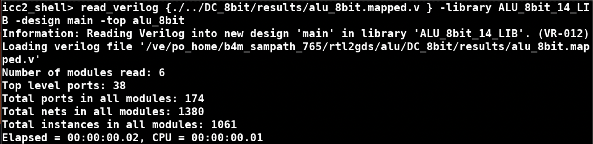
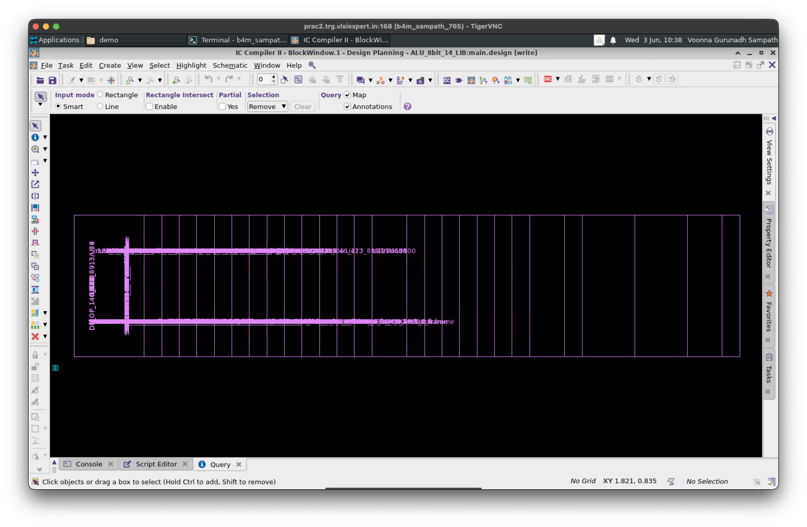
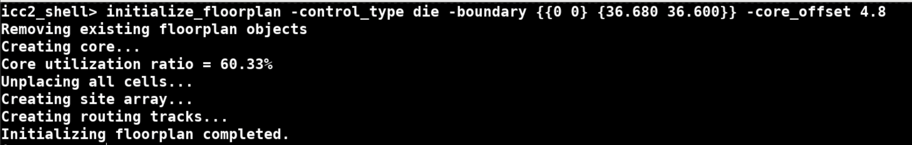
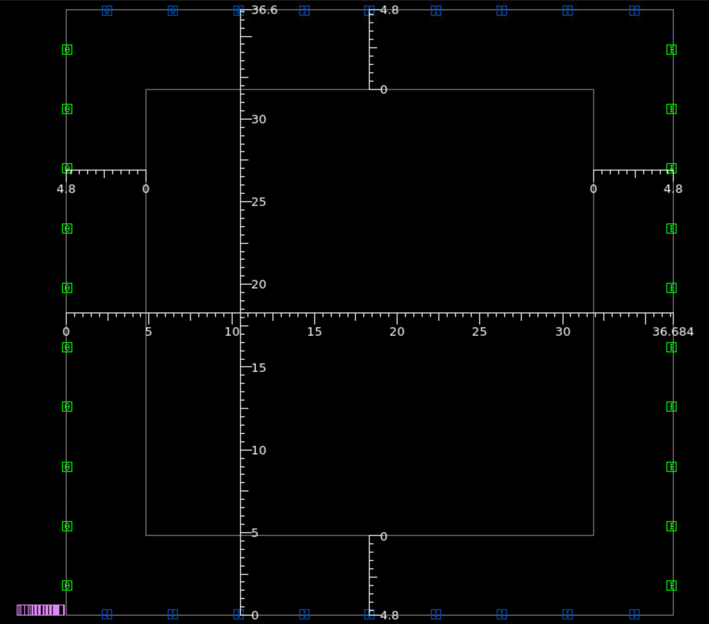

# 8-bit ALU ICC2 Physical Implementation Work

This README records the IC Compiler II physical implementation work done for the 8-bit ALU block. It shows the commands used, the physical changes produced in the GUI, and the reports collected at each stage.

The goal is to present the work clearly enough for someone to follow what was done and understand why each stage matters, without turning this into a full ICC2 tutorial.

The flow starts from the synthesized Design Compiler netlist:

```text
../DC_8bit/results/alu_8bit.mapped.v
```

## Table of Contents

- [Work Overview](#work-overview)
- [Folder Structure](#folder-structure)
- [Script Execution Order](#script-execution-order)
- [How Each Step Is Shown](#how-each-step-is-shown)
- [Design Planning and Floorplanning](#design-planning-and-floorplanning)
- [Power Planning](#power-planning)
- [MMMC Setup](#mmmc-setup)
- [Placement](#placement)
- [Clock Tree Synthesis](#clock-tree-synthesis)
- [Routing and Signoff Checks](#routing-and-signoff-checks)
- [Final Extraction and Handoff Outputs](#final-extraction-and-handoff-outputs)
- [Stage Evidence Tracking](#stage-evidence-tracking)
- [Screenshot Naming Convention](#screenshot-naming-convention)
- [Work Completion Checklist](#work-completion-checklist)

## Work Overview

The `ICCII_8bit` directory contains the physical implementation work for the `alu_8bit` block. The scripts create an ICC2 design library, import the mapped Verilog netlist, initialize the floorplan, build the power grid, place cells, synthesize the clock tree, route the design, run physical checks, and generate final handoff files.

Primary scripts:

```text
scripts/design_planning.tcl
scripts/mmmc_script.tcl
scripts/placement.tcl
scripts/cts.tcl
scripts/routing.tcl
scripts/extracting_reports.tcl
```

## Folder Structure

Current structure and planned locations for screenshots, reports, and final outputs:

```text
ICCII_8bit/
├── README.md
├── scripts/
│   ├── mmmc_script.tcl
│   ├── design_planning.tcl
│   ├── placement.tcl
│   ├── cts.tcl
│   ├── routing.tcl
│   └── extracting_reports.tcl
├── Reports/
├── screenshots/
│   ├── 00_pre_run/
│   ├── 01_mmmc/
│   ├── 02_floorplan/
│   ├── 03_powerplan/
│   ├── 04_placement/
│   ├── 05_cts/
│   ├── 06_routing/
│   ├── 07_signoff/
│   └── 08_outputs/
├── reports/
└── outputs/
```

| Path | Description |
| --- | --- |
| `scripts/` | ICC2 TCL scripts for MMMC setup, floorplanning, power planning, placement, CTS, routing, and final output extraction. |
| `Reports/` | Existing repository location for uploaded report screenshots or selected GUI images. |
| `screenshots/` | Planned location for GUI captures after each major command or stage. |
| `reports/` | Generated by `extracting_reports.tcl`; planned location for final text reports if reports are reorganized later. |
| `outputs/` | Generated by `extracting_reports.tcl`; contains final SPEF, SDF, Verilog, DEF, LEF, and GDS outputs. |

## Script Execution Order

Run the flow in this order from inside `ICCII_8bit`:

```tcl
source scripts/design_planning.tcl
open_block powerplan_block
source scripts/placement.tcl
open_block placement_block
source scripts/cts.tcl
open_block cts_block
source scripts/routing.tcl
open_block alu_8bit
source scripts/extracting_reports.tcl
```

The MMMC setup is sourced by later scripts:

```tcl
source ./scripts/mmmc_script.tcl
```

## How Each Step Is Shown

For each implementation stage, show three types of evidence:

1. GUI screenshots showing physical changes in the layout window.
2. Console or log screenshots showing successful command completion.
3. Text reports showing timing, utilization, design metrics, power, congestion, DRC, LVS, or extracted outputs.

## Design Planning and Floorplanning

Script:

```text
scripts/design_planning.tcl
```

This script performs library creation, netlist import, initial block save, floorplan initialization, pin placement, floorplan reporting, power planning, boundary-cell insertion, tap-cell insertion, and powerplan reporting.

### Library Creation and Netlist Import

Key commands:

```tcl
create_lib -ref_lib ... ALU_8bit_14_LIB
read_verilog {./../DC_8bit/results/alu_8bit.mapped.v } -library ALU_8bit_14_LIB -design main -top alu_8bit
set_ref_libs -add ...
save_lib
save_block
save_block -as pre_floorplan_block
```

Captured after this step:

```tcl
read_verilog {./../DC_8bit/results/alu_8bit.mapped.v } -library ALU_8bit_14_LIB -design main -top alu_8bit
```



### Floorplan Initialization

Key commands:

```tcl
initialize_floorplan -control_type die -boundary {{0 0} {36.680 36.600}} -core_offset {5.040 5.400 5.040 5.400}
place_pins -self
report_utilization > utilization_report_after_floorplanning.txt
report_design > design_report_after_floorplanning.txt
save_block -as floorplan_block
```

#### Pre Floorplan in GUI



```tcl
initialize_floorplan -control_type die -boundary {{0 0} {36.680 36.600}} -core_offset {5.040 5.400 5.040 5.400}
place_pins -self
```

#### Post Floorplan in GUI




## Power Planning

Script:

```text
scripts/design_planning.tcl
```

The power planning section creates power ports, power nets, power shapes, a core ring, a mesh, standard-cell rails, boundary cells, and tap cells.

Key commands:

```tcl
create_port -direction in VDD
create_port -direction in VSS

create_net -power {VDD}
create_net -ground {VSS}

create_shape -shape_type rect -layer M7 -boundary {{0 11.36} {4 12.34}} -port VDD 
create_shape -shape_type rect -layer M7 -boundary {{0.0 15.82} {2.2 16.81}} -port VSS 

connect_pg_net -all_blocks -automatic
```


#### Post powerplan in GUI


## MMMC Setup

Script:

```text
scripts/mmmc_script.tcl
```

Purpose:

- Removes existing modes, corners, and scenarios.
- Creates slow, fast, and typical corners.
- Creates the `func` mode.
- Creates `func_slow`, `func_fast`, and `func_typical` scenarios.
- Reads Cmax, Cmin, and nominal TLUPlus parasitic technology files.
- Applies operating conditions for slow, fast, and typical corners.
- Sources `../CONSTRAINTS/alu_8bit.sdc`.
- Enables setup, hold, power, transition, and capacitance checks per scenario.

Key commands:

```tcl
create_corner slow
create_corner fast
create_corner typical
create_mode func
create_scenario -name func_slow -mode func -corner slow
create_scenario -name func_fast -mode func -corner fast
create_scenario -name func_typical -mode func -corner typical
read_parasitic_tech
set_parasitic_parameters
set_operating_conditions
source ./../CONSTRAINTS/alu_8bit.sdc
set_scenario_status
```

Captured after this stage:

| Captured | What to show |
| --- | --- |
| `screenshots/01_mmmc/01_scenarios.png` | Scenario browser or console output showing `func_slow`, `func_fast`, and `func_typical`. |
| `screenshots/01_mmmc/02_constraints_loaded.png` | Console output showing the SDC file was sourced. |
| `Reports/mmmc_scenarios.png` | Optional screenshot of `report_scenarios`. |

## Placement

Script:

```text
scripts/placement.tcl
```

Expected starting block:

```tcl
open_block powerplan_block
```

Purpose:

- Sources MMMC setup.
- Runs pre-placement design checks.
- Sets placement congestion, density, scan, and pin-access options.
- Applies SDC constraints to all scenarios.
- Restricts routing layers from M2 to M8.
- Runs placement optimization.
- Adds tie cells.
- Checks legality.
- Generates placement reports.
- Saves `placement_block`.

Key commands:

```tcl
source ./scripts/mmmc_script.tcl
check_design -checks pre_placement_stage
set_app_options -name place.coarse.congestion_driven_max_util -value 0.75
set_ignored_layers -min_routing_layer M2 -max_routing_layer M8
place_opt > placement.log
add_tie_cells
check_legality -verbose
report_congestion -rerunglobal > congestion_report_after_placement.txt
report_timing -delay_type max -type full -verbose > timing_report_setup_after_placement.txt
report_timing -delay_type min -type full -verbose > timing_report_hold_after_placement.txt
report_utilization > utilization_report_after_placement.txt
report_power > power_report_after_placement.txt
save_block -as placement_block
```

Captured after this stage:

| Captured | What to show |
| --- | --- |
| `screenshots/04_placement/01_pre_placement_check.png` | Result of `check_design -checks pre_placement_stage`. |
| `screenshots/04_placement/02_after_place_opt.png` | Cell placement after `place_opt`. |
| `screenshots/04_placement/03_tie_cells.png` | Tie cells after `add_tie_cells`. |
| `screenshots/04_placement/04_legality.png` | Result of `check_legality -verbose`. |
| `Reports/placement_congestion.png` | `congestion_report_after_placement.txt`. |
| `Reports/placement_setup_timing.png` | `timing_report_setup_after_placement.txt`. |
| `Reports/placement_hold_timing.png` | `timing_report_hold_after_placement.txt`. |
| `Reports/placement_utilization.png` | `utilization_report_after_placement.txt`. |
| `Reports/placement_power.png` | `power_report_after_placement.txt`. |

Reports generated:

```text
placement.log
congestion_report_after_placement.txt
timing_report_setup_after_placement.txt
timing_report_hold_after_placement.txt
utilization_report_after_placement.txt
power_report_after_placement.txt
```

## Clock Tree Synthesis

Script:

```text
scripts/cts.tcl
```

Expected starting block:

```tcl
open_block placement_block
```

Purpose:

- Sources MMMC setup.
- Reports active scenarios.
- Enables global-route-guided CTS and local skew optimization.
- Sets CTS transition target, instance prefix, and allowed CTS buffer/inverter cells.
- Enables CPPR timing pessimism removal.
- Applies constraints to all scenarios.
- Sets target skew and latency.
- Runs `clock_opt`.
- Sets `clk` as propagated.
- Generates CTS timing and clock-tree reports.
- Saves `cts_block`.

Key commands:

```tcl
report_scenarios
set_app_options -name cts.compile.enable_global_route -value true
set_app_options -name cts.compile.enable_local_skew -value true
set_app_options -name cts.common.default_max_transition -value 0.05
set_lib_cell_purpose -exclude cts [get_lib_cells */*]
set_lib_cell_purpose -include cts [get_lib_cells {...}]
set_app_options -name time.remove_clock_reconvergence_pessimism -value true
set_clock_tree_options -target_skew 0.040
set_clock_tree_options -target_latency 0.300
clock_opt
set_propagated_clock clk
check_timing -type full -verbose
report_clock_tree > cts_report.txt
report_clock_tree_qor > cts_qor_report.txt
report_timing -delay_type max -type full -verbose > timing_report_setup_after_cts.txt
report_timing -delay_type min -type full -verbose > timing_report_hold_after_cts.txt
save_block -as cts_block
```

Captured after this stage:

| Captured | What to show |
| --- | --- |
| `screenshots/05_cts/01_scenarios.png` | Active scenarios before CTS. |
| `screenshots/05_cts/02_clock_tree_after_clock_opt.png` | Clock tree after `clock_opt`. |
| `screenshots/05_cts/03_propagated_clock.png` | Clock shown as propagated after `set_propagated_clock clk`. |
| `Reports/cts_clock_tree.png` | `cts_report.txt`. |
| `Reports/cts_qor.png` | `cts_qor_report.txt`. |
| `Reports/cts_setup_timing.png` | `timing_report_setup_after_cts.txt`. |
| `Reports/cts_hold_timing.png` | `timing_report_hold_after_cts.txt`. |

Reports generated:

```text
cts_report.txt
cts_qor_report.txt
timing_report_setup_after_cts.txt
timing_report_hold_after_cts.txt
```

## Routing and Signoff Checks

Script:

```text
scripts/routing.tcl
```

Expected starting block:

```tcl
open_block cts_block
```

Purpose:

- Sources MMMC setup.
- Sets global-routing, detail-routing, and route common options.
- Runs global route, track assignment, detail route, and route optimization.
- Checks routes and LVS.
- Generates timing, power, and congestion reports after routing.
- Performs incremental detail routing and route optimization.
- Adds standard-cell fillers.
- Runs signoff DRC before and after metal fill.
- Saves `routed_block` and final `alu_8bit` block.

Key commands:

```tcl
route_global
route_track
route_detail
route_opt > routing.log
check_routes
check_lvs
report_timing -delay_type max -type full -verbose > timing_report_setup_after_routing.txt
report_timing -delay_type min -type full -verbose > timing_report_hold_after_routing.txt
report_power > power_report_after_routing.txt
report_congestion -rerunglobal > congestion_report_after_routing.txt
route_detail -inceremental true -initial_drc true > incremental_routing.log
route_opt > incremental_routing_opt.log
create_stdcell_filler ...
check_legality
signoff_check_drc
signoff_create_metal_fill -timing_preserve_setup_slack_threshold 0.1
update_timing
signoff_check_drc
save_block -as routed_block
save_block -as alu_8bit
```

Captured after this stage:

| Captured | What to show |
| --- | --- |
| `screenshots/06_routing/01_global_route.png` | Routing after `route_global`. |
| `screenshots/06_routing/02_track_assignment.png` | Routing after `route_track`. |
| `screenshots/06_routing/03_detail_route.png` | Routed wires after `route_detail`. |
| `screenshots/06_routing/04_route_opt.png` | Layout after `route_opt`. |
| `screenshots/06_routing/05_check_routes.png` | `check_routes` result. |
| `screenshots/06_routing/06_check_lvs.png` | `check_lvs` result. |
| `screenshots/07_signoff/01_fillers.png` | Standard-cell fillers after `create_stdcell_filler`. |
| `screenshots/07_signoff/02_drc_before_fill.png` | DRC result before metal fill. |
| `screenshots/07_signoff/03_metal_fill.png` | Layout after `signoff_create_metal_fill`. |
| `screenshots/07_signoff/04_drc_after_fill.png` | Final DRC result after metal fill. |
| `Reports/routing_setup_timing.png` | `timing_report_setup_after_routing.txt`. |
| `Reports/routing_hold_timing.png` | `timing_report_hold_after_routing.txt`. |
| `Reports/routing_power.png` | `power_report_after_routing.txt`. |
| `Reports/routing_congestion.png` | `congestion_report_after_routing.txt`. |

Reports generated:

```text
routing.log
timing_report_setup_after_routing.txt
timing_report_hold_after_routing.txt
power_report_after_routing.txt
congestion_report_after_routing.txt
incremental_routing.log
incremental_routing_opt.log
drc_signoff/
drc_after_fill/
```

Note: The script currently uses `route_detail -inceremental true`. Verify this option spelling in your ICC2 version before running the incremental routing step.

## Final Extraction and Handoff Outputs

Script:

```text
scripts/extracting_reports.tcl
```

Expected starting block:

```tcl
open_block alu_8bit
```

Purpose:

- Creates `outputs/` and `reports/`.
- Writes slow, fast, and typical SPEF files.
- Writes final Verilog netlist.
- Writes slow and fast SDF files.
- Writes DEF, LEF, and merged GDS.
- Creates frame and abstract views for hard-macro integration.
- Saves the final block and library.

Key commands:

```tcl
file mkdir outputs
file mkdir reports
write_parasitics -format spef -corner $corner_slow -output outputs/alu_8bit_slow.spef
write_parasitics -format spef -corner $corner_fast -output outputs/alu_8bit_fast.spef
write_parasitics -format spef -corner $corner_typical -output outputs/alu_8bit_typical.spef
write_verilog -hierarchy all -top_module_first outputs/alu_8bit_netlist.v
write_sdf -corner $corner_slow -mode $mode1 outputs/alu_8bit_slow.sdf
write_sdf -corner $corner_fast -mode $mode1 outputs/alu_8bit_fast.sdf
write_def outputs/alu_8bit.def
write_lef outputs/alu_8bit_abstract.lef
write_gds -merge_files ... outputs/alu_8bit_final.gds
create_frame
create_abstract
save_block
save_lib
```

Captured after this stage:

| Captured | What to show |
| --- | --- |
| `screenshots/08_outputs/01_outputs_directory.png` | `outputs/` directory containing SPEF, SDF, Verilog, DEF, LEF, and GDS files. |
| `screenshots/08_outputs/02_final_block.png` | Final `alu_8bit` block opened in ICC2. |
| `screenshots/08_outputs/03_abstract_frame.png` | Frame or abstract view after `create_frame` and `create_abstract`. |

Expected outputs:

```text
outputs/alu_8bit_slow.spef
outputs/alu_8bit_fast.spef
outputs/alu_8bit_typical.spef
outputs/alu_8bit_netlist.v
outputs/alu_8bit_slow.sdf
outputs/alu_8bit_fast.sdf
outputs/alu_8bit.def
outputs/alu_8bit_abstract.lef
outputs/alu_8bit_final.gds
```

## Stage Evidence Tracking

Use this table to organize the evidence for each physical implementation stage.

| Stage | Pre-State to Capture | Post-State to Capture | Reports to Attach |
| --- | --- | --- | --- |
| Netlist import | Empty/new ICC2 library state | `alu_8bit` imported and saved as `pre_floorplan_block` | Console import log, library/reference-library screenshot |
| Floorplan | Imported netlist before floorplan | Die/core boundary and placed pins | `utilization_report_after_floorplanning.txt`, `design_report_after_floorplanning.txt` |
| Power planning | Floorplan before PG creation | PG ports, nets, ring, mesh, rails, boundary cells, tap cells | `utilization_report_after_powerplanning.txt`, `design_report_after_powerplanning.txt`, PG DRC/connectivity screenshots |
| Placement | `powerplan_block` before placement | Legalized placed cells and tie cells | `congestion_report_after_placement.txt`, setup/hold timing after placement, utilization after placement, power after placement |
| CTS | `placement_block` before clock tree | Clock buffers/inverters inserted and `clk` propagated | `cts_report.txt`, `cts_qor_report.txt`, setup/hold timing after CTS |
| Routing | `cts_block` before routing | Global/detail routed design and route optimized design | Setup/hold timing after routing, power after routing, congestion after routing, DRC/LVS screenshots |
| Signoff fill/DRC | Routed design before filler and metal fill | Filler inserted, metal fill created, final DRC completed | `drc_signoff/`, `drc_after_fill/`, legality screenshots |
| Extraction | Final routed `alu_8bit` block | SPEF, SDF, Verilog, DEF, LEF, GDS, frame, and abstract created | `outputs/` directory screenshot |

For utilization, timing, area/design, and power comparison across stages, keep the stage names consistent:

```text
floorplan
powerplan
placement
cts
routing
signoff
```

Suggested report naming:

```text
Reports/<stage>_utilization.png
Reports/<stage>_setup_timing.png
Reports/<stage>_hold_timing.png
Reports/<stage>_design_or_area.png
Reports/<stage>_power.png
Reports/<stage>_congestion.png
Reports/<stage>_drc_lvs.png
```

## Screenshot Naming Convention

Use numbered filenames so the screenshots match the command sequence.

Suggested format:

```text
NN_command_or_checkpoint.png
```

Examples:

```text
screenshots/02_floorplan/04_floorplan_boundary.png
screenshots/03_powerplan/02_power_ring.png
screenshots/04_placement/02_after_place_opt.png
screenshots/05_cts/02_clock_tree_after_clock_opt.png
screenshots/06_routing/03_detail_route.png
screenshots/07_signoff/04_drc_after_fill.png
```

Each screenshot should show one clear GUI state, such as:

- Layout after a command changes geometry.
- Report window after a report command completes.
- Console output after a check command reports pass/fail status.
- Block browser showing the current saved checkpoint.

## Work Completion Checklist

Before considering this ICC2 work complete, confirm that:

- `ALU_8bit_14_LIB` was created.
- `alu_8bit.mapped.v` was imported.
- `pre_floorplan_block` was saved.
- Floorplan boundary and pins were created.
- `floorplan_block` was saved.
- PG ports, nets, ring, mesh, and rails were created.
- PG DRC and connectivity checks were captured.
- Boundary cells and tap cells were inserted.
- `powerplan_block` was saved.
- Placement completed with `place_opt`.
- Tie cells were inserted.
- Placement timing, utilization, power, and congestion reports were generated.
- `placement_block` was saved.
- CTS completed with `clock_opt`.
- Clock-tree and CTS timing reports were generated.
- `cts_block` was saved.
- Global route, track assignment, detail route, and route optimization completed.
- Routing timing, power, and congestion reports were generated.
- Route checks and LVS checks were captured.
- Filler insertion and metal fill were completed.
- Signoff DRC before and after fill was captured.
- `routed_block` and `alu_8bit` were saved.
- Final SPEF, SDF, Verilog, DEF, LEF, and GDS files were generated.
- GUI screenshots are stored using the stage-based naming convention.
