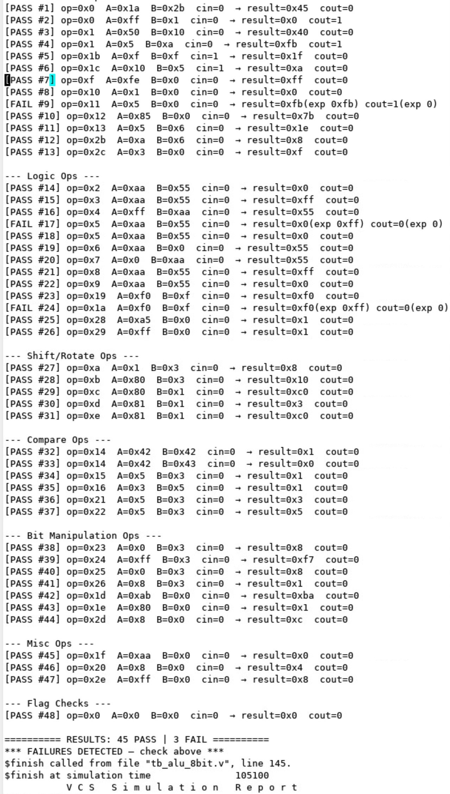
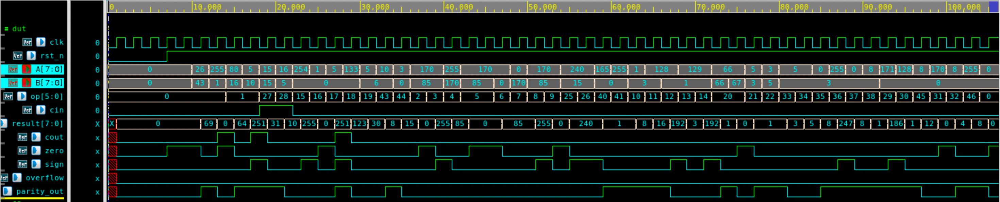
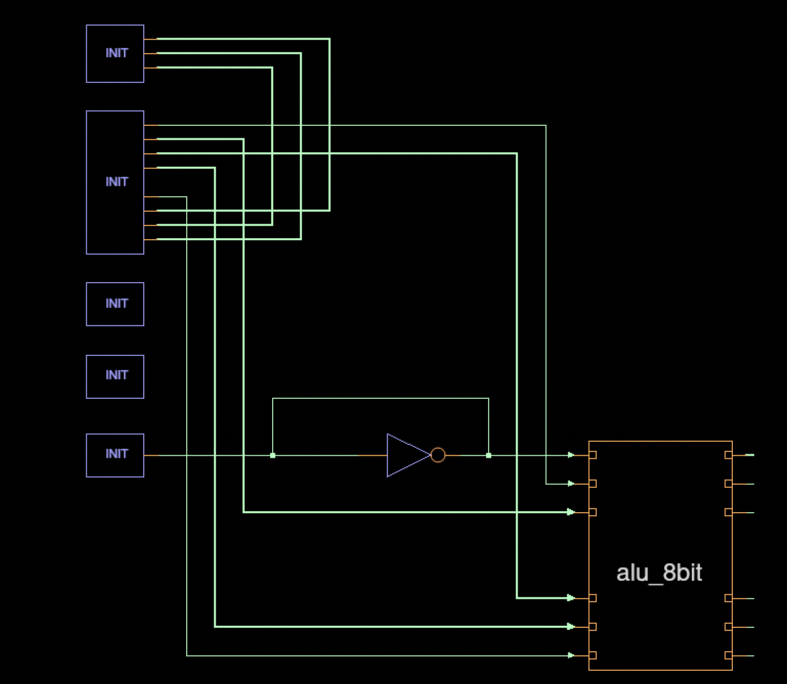

# 8-bit ALU Block-Level RTL to GDS Flow

This folder shows the work I did for the 8-bit ALU block, starting from RTL and moving through simulation, waveform debug, synthesis, physical implementation, and final GDS generation.

The goal of this README is to show the project flow in a way that someone else can follow. I am keeping the detailed Design Compiler and ICC2 work inside their own folders, and this file acts as the main flow path from `rtl/` to final layout outputs.

## Table of Contents

- [Project Flow](#project-flow)
- [Folder Structure](#folder-structure)
- [Step 1: RTL Design](#step-1-rtl-design)
- [Step 2: VCS Simulation](#step-2-vcs-simulation)
- [Step 3: Verdi Debug](#step-3-verdi-debug)
- [Step 3.5: SDC Timing Constraints](#step-35-sdc-timing-constraints)
- [Step 4: Design Compiler Synthesis](#step-4-design-compiler-synthesis)
- [Step 5: ICC2 Physical Implementation](#step-5-icc2-physical-implementation)
- [Step 6: Final GDS Handoff](#step-6-final-gds-handoff)
- [Screenshots and Results](#screenshots-and-results)

## Project Flow

I followed this overall flow:

```text
RTL
  |
  v
VCS simulation
  |
  v
Verdi waveform/debug
  |
  v
Design Compiler synthesis
  |
  v
ICC2 floorplan, power plan, placement, CTS, routing
  |
  v
Final outputs: netlist, SDF, SPEF, DEF, LEF, GDS
```

The main idea is:

1. I verified the RTL.
2. I ran simulation using VCS.
3. I used Verdi to view waveforms and debug the ALU behavior.
4. I synthesized the RTL using Design Compiler.
5. I took the mapped netlist into ICC2.
6. I completed the physical implementation flow up to final GDS generation.

## Folder Structure

```text
BLock Level Design (8bit ALU)/
├── README.md
├── rtl/
│   ├── alu_8bit.v
│   └── tb_alu_8bit.v
├── CONSTRAINTS/
│   └── alu_8bit.sdc
├── DC_8bit/
│   ├── README.md
│   ├── run_dc.tcl
│   ├── rm_setup/
│   └── Reports/
├── ICCII_8bit/
│   ├── README.md
│   ├── scripts/
│   └── Reports/
└── Reports/
```

| Path | What I used it for |
| --- | --- |
| [`rtl/`](rtl/) | RTL design and testbench for the 8-bit ALU. |
| [`CONSTRAINTS/`](CONSTRAINTS/) | Timing and design constraints used by synthesis and physical implementation. |
| [`DC_8bit/`](DC_8bit/) | Design Compiler synthesis work. Detailed flow is in [`DC_8bit/README.md`](DC_8bit/README.md). |
| [`ICCII_8bit/`](ICCII_8bit/) | ICC2 physical implementation work from mapped netlist to final GDS. Detailed flow is in [`ICCII_8bit/README.md`](ICCII_8bit/README.md). |
| `Reports/` | Place for screenshots from VCS, Verdi, and the overall project flow. |

## Step 1: RTL Design

I started with the 8-bit ALU RTL and its testbench:

```text
rtl/alu_8bit.v
rtl/tb_alu_8bit.v
```

The RTL file contains the ALU design logic. The testbench is used to apply inputs, run simulation, and check how the ALU responds for different operations.

Before moving to synthesis, I first verified the RTL behavior through simulation and waveform debug.

## Step 2: VCS Simulation

I used VCS to compile and run the RTL simulation.

Run from this folder:

```sh
cd "VCS and Verdi"
```

Compile the RTL and testbench:

```sh
vcs -full64 -sverilog -debug_access+all -kdb ./../rtl/alu_8bit.v ./../rtl/tb_alu_8bit.v -o simv_8bit
```

Run the simulation:

```sh
./simv_8bit -l sim.log
```

What I check after this step:

- VCS compilation completed without fatal errors.
- Simulation ran successfully.
- The ALU input and output behavior matched the expected testbench behavior.
- Log files such as `vcs_compile.log` and `sim.log` were generated.

After running VCS, the screenshots of the compile and simulation result here:



## Step 3: Verdi Debug

After VCS simulation, I used Verdi to inspect the waveform and debug the ALU behavior visually.

The simulation generates an FSDB waveform, open it with:

```sh
verdi -ssf alu_8bit_tb.fsdb &
```

Signals I check in Verdi:

- `clk`
- `rst_n`
- `A`
- `B`
- `op`
- `cin`
- `result`
- `cout`
- `zero`
- `sign`
- `overflow`
- `parity_out`

Results from Verdi:

- The testbench driving ALU inputs.
- Output changes for each operation.
- Reset behavior.
- Flag behavior for carry, zero, sign, overflow, and parity.
- The waveform proving that the RTL is working before synthesis.

After opening the waveform in Verdi, the GUI screenshots here:

### Waveform of the Testbench



#### Schematic view of the Testbench module in Verdi



## Step 3.5: SDC Timing Constraints

After verifying the RTL functionality in Verdi, I prepared the SDC timing constraints used for synthesis and physical implementation.

Constraint file:

```text
CONSTRAINTS/alu_8bit.sdc
```

The SDC file defines the timing environment for the design and is used throughout the Design Compiler and ICC2 flow.

Main constraints included in the SDC:

- Clock definition using `create_clock`
- Virtual clock definition for IO timing reference
- Clock uncertainty constraints
- Clock transition constraints
- Input delay constraints
- Output delay constraints
- Driving cell constraints for input ports
- Output load constraints
- False path constraints for reset signals
- Clock group and timing environment setup

Purpose of the virtual clock:

- The virtual clock is used as a reference for external input and output timing.
- It helps define realistic IO timing behavior even though the external clock is not physically connected inside the design.
- It is mainly used for proper setup and hold analysis on input and output paths.

The SDC constraints guide:

- RTL synthesis optimization
- Timing analysis
- Placement optimization
- Clock tree synthesis (CTS)
- Routing optimization
- Final signoff timing checks

These constraints ensure that the design is optimized and analyzed under a consistent timing environment across the complete RTL-to-GDS flow.

## Step 4: Design Compiler Synthesis

After RTL simulation and waveform debug, I moved to Design Compiler synthesis.

The complete synthesis work is kept in:

```text
DC_8bit/
```

Detailed synthesis README:

```text
DC_8bit/README.md
```

Main script:

```text
DC_8bit/run_dc.tcl
```

What I did in this stage:

- Analyzed the RTL.
- Elaborated the `alu_8bit` design.
- Applied the SDC constraints.
- Ran `compile_ultra`.
- Generated mapped synthesis outputs.
- Captured Design Vision schematics.
- Collected timing, area, power, QoR, threshold voltage, and other reports.

Follow the detailed synthesis work here:

[`DC_8bit/README.md`](DC_8bit/README.md)

## Step 5: ICC2 Physical Implementation

After synthesis, the mapped netlist from Design Compiler is the starting point for ICC2.

Input netlist:

```text
DC_8bit/results/alu_8bit.mapped.v
```

The complete ICC2 work is kept in:

```text
ICCII_8bit/
```

Detailed ICC2 README:

```text
ICCII_8bit/README.md
```

What I did in ICC2:

- Created the ICC2 design library.
- Imported the mapped Verilog netlist.
- Created the floorplan.
- Built the power plan with rings, mesh, and rails.
- Inserted boundary and tap cells.
- Ran placement.
- Ran CTS.
- Ran routing.
- Performed DRC/LVS-related checks.
- Added filler and metal fill.
- Saved the final routed block.

Follow the detailed physical implementation work here:

[`ICCII_8bit/README.md`](ICCII_8bit/README.md)

## Step 6: Final GDS Handoff

At the end of the ICC2 flow, These files will be generated as the final design handoff files.

Expected final outputs from the ICC2 extraction stage:

```text
ICCII_8bit/outputs/alu_8bit_slow.spef
ICCII_8bit/outputs/alu_8bit_fast.spef
ICCII_8bit/outputs/alu_8bit_typical.spef
ICCII_8bit/outputs/alu_8bit_netlist.v
ICCII_8bit/outputs/alu_8bit_slow.sdf
ICCII_8bit/outputs/alu_8bit_fast.sdf
ICCII_8bit/outputs/alu_8bit.def
ICCII_8bit/outputs/alu_8bit_abstract.lef
ICCII_8bit/outputs/alu_8bit_final.gds
```

The final GDS file is:

```text
ICCII_8bit/outputs/alu_8bit_final.gds
```

This is the final layout database output of the block-level physical implementation flow.

## Screenshots and Results

I will use screenshots to show what happened at important points in the flow. The screenshots are not meant to teach every tool command in detail; they show the actual work and GUI results from this project.

Suggested screenshot list:

| Stage | Screenshot |
| --- | --- |
| VCS simulation | `VCS_and_Verdi/Images/vcs_simulation_result.png` |
| Verdi waveform overview | `VCS_and_Verdi/Images/verdi_waveform_overview.png` |
| Verdi schematic view | `VCS_and_Verdi/Images/verdi_alu_schematic.png` |
| Design Compiler schematic/report images | `DC_8bit/Reports/` |
| ICC2 floorplan, power plan, placement, CTS, routing images | `ICCII_8bit/Reports/` |

For the detailed DC and ICC2 screenshots and reports, refer to:

- [`DC_8bit/README.md`](DC_8bit/README.md)
- [`ICCII_8bit/README.md`](ICCII_8bit/README.md)
